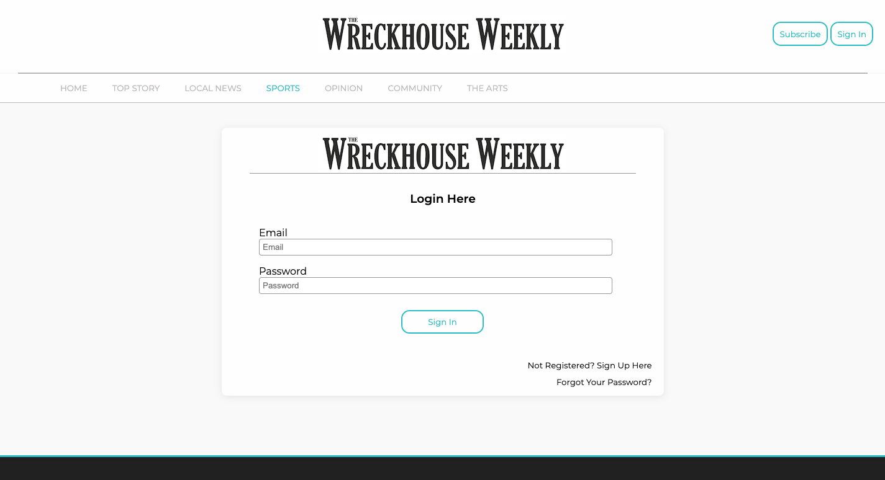
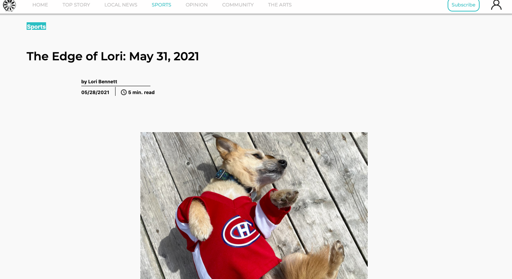
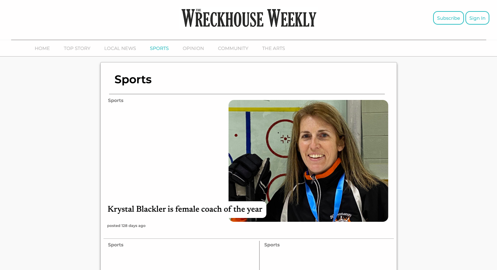
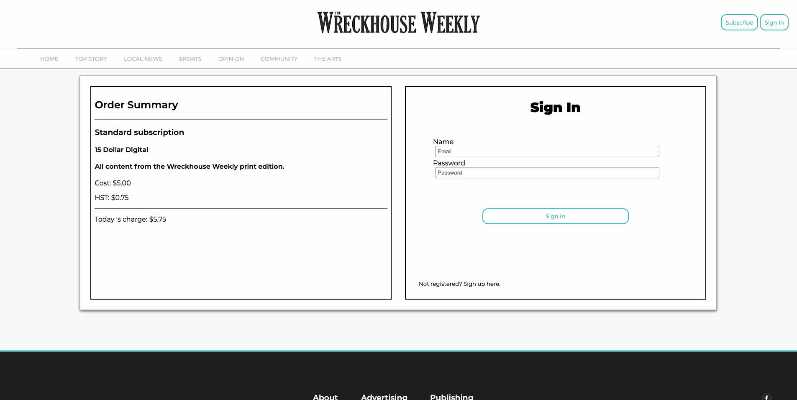

# Wreckhouse Press 
 The frontend for Wreckhouse Press's website, A Weekly newspaper based in Newfoundland.
## Live 
  [Check it out live here.](https://wreck-house-press-front-alpha.vercel.app/)
## Screenshots
#### Screenshot of Homepage

#### Screenshot of Sign In Page

#### Screenshot of Article

#### Screenshot of Category

#### Screenshot of Checkout

## Tech Stack
* Front-End: HTML, CSS, Next.js, Bootstrap, Vercel.

* Back-End: Ruby on Rails API, Postgres, Heroku.

## Setup

* Install dependencies with `npm install`.
* Fork & Install dependencies for Backend [here](https://github.com/kylemcloughlin/wreck-house-press-back)
* Run `rails s -p 3001` - Backend
* Run `npm run dev` - Frontend

## Dependencies 
  *  antd - ^4.14.0
  *  axios - ^0.21.1
  *  babel-plugin-transform-define - ^2.0.0
  *  dotenv - ^8.2.0
  *  md5 - ^2.3.0
  *  moment-timezone - ^0.5.33
  *  next - 10.0.7
  *  nookies - ^2.5.2
  *  react - 17.0.1
  *  react-burger-menu - ^2.7.1
  *  react-cookie - ^4.0.3
  *  react-datetime - ^3.0.4
  *  react-dom - 17.0.1
  *  react-spring - ^8.0.27
  *  resize-observer-polyfill - ^1.5.1
  *  stripe - ^8.138.0
